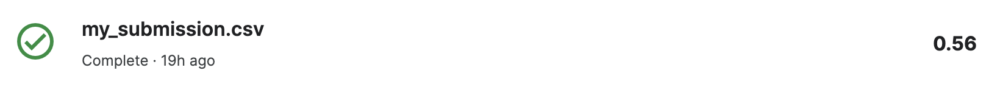
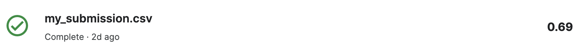
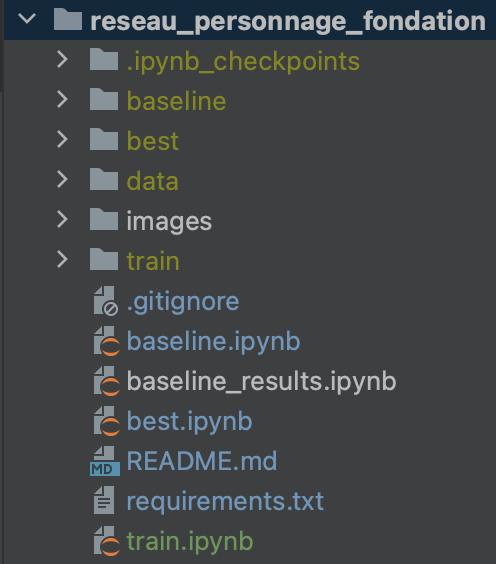

# Génération de réseaux de personnages

Ce projet vise à générer des réseaux de personnages à partir des livres "Prélude à la fondation" et "Les cavernes d’acier" du corpus Fondation.

# Méthodologies

Les méthodologies utilisées dans ce projet sont organisées en 6 étapes :

1. **Extraction des personnages:** Les personnages sont extraits à partir des textes des livres.
   
2. **Résolution des alias:** La résolution des alias est effectuée pour traiter les variations de noms ou d'identifiants pour un même personnage.

3. **Identification des interactions:** Les interactions entre les personnages sont identifiées pour créer des liens significatifs.

4. **Construction des graphes:** Les graphes de réseau sont construits en utilisant les personnages comme nœuds et les interactions comme arêtes.

5. **Calcul des statistiques de centralité:** Des mesures de centralité telles que le Pagerank, l'Eigenvector, l'Betweenness, le Degree et le Closeness sont calculées pour évaluer l'importance des personnages dans les réseaux.

6. **Détection des communautés:** Les communautés de personnages sont détectées à l'aide d'algorithmes tels que Louvain pour identifier des groupes cohérents.

De toutes ces tâches, il n’y a que les 2 premières qui influencent les résultats et les autres ne sont que des simples traitements.

Pour la première tâche,  2 approches ont été abordées:
1. **Utilisation d’un NER**: le modèle [ner-large](https://flairnlp.github.io/docs/tutorial-basics/tagging-entities#tagging-entities-with-our-best-model) de Flair
2. **Détection manuelle**: lire les chapitres et détecter les personnages

Pour la deuxième tâche,  2 approches ont été  abordées:
1. **Utilisation de la distance de Levenshtein**: nombre minimale d'opération permettant de passer d'un mot à un autre
2. **Détection manuelle**: lire les chapitres et détecter les alias

# Résultats

Comme précédemment expliqué, nous n’avons effectué que 2 approches:
1. **Automatique**: ce qui nous a donné une moyenne des **f1-score des noeuds et des arêtes** de **56%**

2. **Manuelle**: ce qui nous donné une moyenne des **f1-score des noeuds et des arêtes** de **69%**

On peut constater une légère amélioration, mais avec assez d’effort vu que la deuxième approche nécessite de lire tous les chapitres du corpus.

# Préparation de l’environnement 

Pour reproduire les résultats obtenus, il faut tout d’abord s’assurer d’avoir toutes bibliothèques nécessaires avec les bonnes versions sont installées, pour cela il faut commencer par créer un environnement virtuel avec python 3.9, ci-dessous la commande:

`conda create --name character_network python=3.9`

Par la suite vous pouvez l’activer en faisant:

`conda activate character_network`

Par la suite, il faut installer toutes les librairies présentent dans le fichier requirements.txt, pour cela, il suffit de faire:

`pip install -r requirements.txt`

# Télécharger les données

Vu que nous avons généré assez de fichiers pour éviter de saturer notre projet, nous avons décidé de les mettre sur un drive dont les liens sont indiqués ci-dessous:

- **Repertoire data**: [data](https://drive.google.com/drive/folders/1-4Mvf-ghSVSUkTe-kpzzoEr1PCuFDVwc?usp=sharing)
- **Répertoire baseline**: [baseline](https://drive.google.com/drive/folders/19e7xp-Imk33jzo7fxd4r5xw90RMxfusT?usp=sharing)
- **Répertoire best**: [best](https://drive.google.com/drive/folders/13yCr00ALAIB0PKUhqjVHYM21kxo-rlEC?usp=sharing)

Une fois téléchargées, mettez ces répertoires à la racine du projet, de sorte à avoir la structure ci-dessous:

# Lancer jupyter notebook

Une fois que vous avez la bonne structure, vous pouvez lancer jupyter notebook en faisant:

`jupyter notebook`

Vous trouverez ainsi tout le contenu du projet à l'adresse:

http://127.0.0.1:8888/tree

# Approche automatique
## Régénérer tous les résultats
Le code permettant de reproduire des résultats de l’approche automatique se trouve dans le fichier baseline.ipynb, il vous suffit d'exécuter toutes les cellules et vous verrez les graphes ainsi que les statistiques de centralités mais aussi les communautés. 
Toutefois, celà prendra assez de temps approximativement **22 minutes** pour voir tous les résultats, vous pouvez faire celà une seule fois si vous voulez.

Ce code générera aussi un fichier **my_submission.csv** qui contient les graphes que vous pourrez soumettre sur le kaggle pour voir les performances.

## Consulter juste les résultats

Si toutefois, vous ne voulez que voire les résultats, pouvez juste exécuter le fichier **baseline_results.ipynb**, où j’ai déjà enlevé les lignes qui effectuent la génération des résultats, pour juste laisser la partie qui concerne les résultats, celà est possible parcequ’on avait stocké les résultats de chaque partie dans des fichiers séparés pour une réutilisabilité.

# Approche manuelle

Le code permettant de reproduire les résultats de l’approche manuelle se trouve dans le fichier best.ipynb, il vous suffit d’exécuter toutes les cellules pour voir tous les résultats.

De même que précédemment, un fichier **my_submission.csv** sera généré que vous pourrez soumettre à la compétition sur kaggle pour voir les performances.

# Auteurs

- **Michel Marie LAMAH**, étudiant M2 IA, CERI, Université d'Avignon
- **Aïda Fatou Madjidiene DIEDHIOU**, étudiante M2 SICOM, CERI, Université d'Avignon

N'hésitez pas à contribuer en soumettant des problèmes ou des demandes de fonctionnalités.
